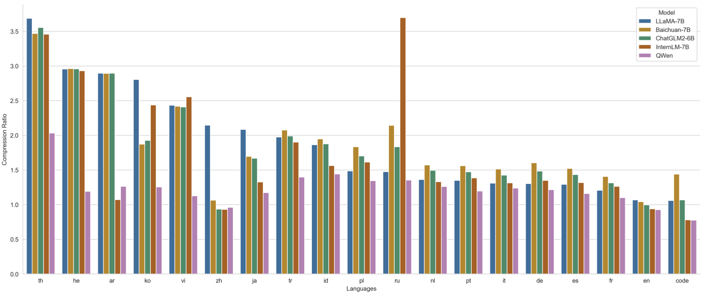

---
language:
- zh
- en
tags:
- qwen
pipeline_tag: text-generation
inference: false
---

# Qwen-72B

<p align="center">
    
<p>
<br>

<p align="center">
        🤗 <a href="https://huggingface.co/Qwen">Hugging Face</a>&nbsp&nbsp | &nbsp&nbsp🤖 <a href="https://modelscope.cn/organization/qwen">ModelScope</a>&nbsp&nbsp | &nbsp&nbsp 📑 <a href="https://arxiv.org/abs/2309.16609">Paper</a> &nbsp&nbsp ｜ &nbsp&nbsp🖥️ <a href="https://modelscope.cn/studios/qwen/Qwen-72B-Chat-Demo/summary">Demo</a>
<br>
<a href="assets/wechat.png">WeChat (微信)</a>&nbsp&nbsp | &nbsp&nbsp<a href="https://discord.gg/z3GAxXZ9Ce">Discord</a>&nbsp&nbsp ｜  &nbsp&nbsp<a href="https://dashscope.aliyun.com">API</a> 
</p>
<br>

## 介绍 (Introduction)

**通义千问-72B**（**Qwen-72B**）是阿里云研发的通义千问大模型系列的720亿参数规模的模型。Qwen-72B是基于Transformer的大语言模型, 在超大规模的预训练数据上进行训练得到。预训练数据类型多样，覆盖广泛，包括大量网络文本、专业书籍、代码等。同时，在Qwen-72B的基础上，我们使用对齐机制打造了基于大语言模型的AI助手Qwen-72B-Chat。本仓库为Qwen-72B的仓库。

通义千问-72B（Qwen-72B）主要有以下特点：

1. **大规模高质量训练语料**：使用超过3万亿tokens的数据进行预训练，包含高质量中、英、多语言、代码、数学等数据，涵盖通用及专业领域的训练语料。通过大量对比实验对预训练语料分布进行了优化。
2. **强大的性能**：Qwen-72B在多个中英文下游评测任务上（涵盖常识推理、代码、数学、翻译等），效果显著超越现有的开源模型。具体评测结果请详见下文。
3. **覆盖更全面的词表**：相比目前以中英词表为主的开源模型，Qwen-72B使用了约15万大小的词表。该词表对多语言更加友好，方便用户在不扩展词表的情况下对部分语种进行能力增强和扩展。
4. **较长的上下文支持**：Qwen-72B支持32k的上下文长度。

如果您想了解更多关于通义千问72B开源模型的细节，我们建议您参阅[GitHub代码库](https://github.com/QwenLM/Qwen)。

**Qwen-72B** is the 72B-parameter version of the large language model series, Qwen (abbr. Tongyi Qianwen), proposed by Alibaba Cloud. Qwen-72B is a Transformer-based large language model, which is pretrained on a large volume of data, including web texts, books, codes, etc. Additionally, based on the pretrained Qwen-72B, we release Qwen-72B-Chat, a large-model-based AI assistant, which is trained with alignment techniques. This repository is the one for Qwen-72B.

The features of Qwen-72B include:

1. **Large-scale high-quality training corpora**: It is pretrained on over 3 trillion tokens, including Chinese, English, multilingual texts, code, and mathematics, covering general and professional fields. The distribution of the pre-training corpus has been optimized through a large number of ablation experiments.
2. **Competitive performance**: It significantly surpasses existing open-source models on multiple Chinese and English downstream evaluation tasks (including commonsense, reasoning, code, mathematics, etc.). See below for specific evaluation results.
3. **More comprehensive vocabulary coverage**: Compared with other open-source models based on Chinese and English vocabularies, Qwen-72B uses a vocabulary of over 150K tokens. This vocabulary is more friendly to multiple languages, enabling users to directly further enhance the capability for certain languages without expanding the vocabulary.
4. **Longer context support**: Qwen-72B supports 32k context length.

For more details about the open-source model of Qwen-72B, please refer to the [GitHub](https://github.com/QwenLM/Qwen) code repository.
<br>

## 要求（Requirements）

* python 3.8及以上版本
* pytorch 1.12及以上版本，推荐2.0及以上版本
* 建议使用CUDA 11.4及以上（GPU用户、flash-attention用户等需考虑此选项）
* **运行BF16或FP16模型需要多卡至少144GB显存（例如2xA100-80G或5xV100-32G）；运行Int4模型至少需要48GB显存（例如1xA100-80G或2xV100-32G）。**
* python 3.8 and above
* pytorch 1.12 and above, 2.0 and above are recommended
* CUDA 11.4 and above are recommended (this is for GPU users, flash-attention users, etc.)
   **To run Qwen-72B-Chat in bf16/fp16, at least 144GB GPU memory is required (e.g., 2xA100-80G or 5xV100-32G). To run it in int4, at least 48GB GPU memory is requred (e.g., 1xA100-80G or 2xV100-32G).**
<br>

## 依赖项 (Dependency)

运行Qwen-72B，请确保满足上述要求，再执行以下pip命令安装依赖库

To run Qwen-72B, please make sure you meet the above requirements, and then execute the following pip commands to install the dependent libraries.

```bash
pip install transformers==4.32.0 accelerate tiktoken einops scipy transformers_stream_generator==0.0.4 peft deepspeed
```

另外，推荐安装`flash-attention`库（**当前已支持flash attention 2**），以实现更高的效率和更低的显存占用。

In addition, it is recommended to install the `flash-attention` library (**we support flash attention 2 now.**) for higher efficiency and lower memory usage.

```bash
git clone https://github.com/Dao-AILab/flash-attention
cd flash-attention && pip install .
# 下方安装可选，安装可能比较缓慢。
# Below are optional. Installing them might be slow.
# pip install csrc/layer_norm
# 如果你的flash-attn版本高于2.1.1，下方不需要安装。
# If the version of flash-attn is higher than 2.1.1, the following is not needed.
# pip install csrc/rotary
```
<br>

## 快速使用（Quickstart）

您可以通过以下代码轻松调用：

You can easily call the model with the following code:

```python
from transformers import AutoModelForCausalLM, AutoTokenizer
from transformers.generation import GenerationConfig

# Note: The default behavior now has injection attack prevention off.
tokenizer = AutoTokenizer.from_pretrained("Qwen/Qwen-72B", trust_remote_code=True)

# use bf16
# model = AutoModelForCausalLM.from_pretrained("Qwen/Qwen-72B", device_map="auto", trust_remote_code=True, bf16=True).eval()
# use fp16
# model = AutoModelForCausalLM.from_pretrained("Qwen/Qwen-72B", device_map="auto", trust_remote_code=True, fp16=True).eval()
# use cpu only
# model = AutoModelForCausalLM.from_pretrained("Qwen/Qwen-72B", device_map="cpu", trust_remote_code=True).eval()
# use auto mode, automatically select precision based on the device.
model = AutoModelForCausalLM.from_pretrained("Qwen/Qwen-72B", device_map="auto", trust_remote_code=True).eval()

# Specify hyperparameters for generation. But if you use transformers>=4.32.0, there is no need to do this.
# model.generation_config = GenerationConfig.from_pretrained("Qwen/Qwen-72B", trust_remote_code=True)

inputs = tokenizer('蒙古国的首都是乌兰巴托（Ulaanbaatar）\n冰岛的首都是雷克雅未克（Reykjavik）\n埃塞俄比亚的首都是', return_tensors='pt')
inputs = inputs.to(model.device)
pred = model.generate(**inputs)
print(tokenizer.decode(pred.cpu()[0], skip_special_tokens=True))
# 蒙古国的首都是乌兰巴托（Ulaanbaatar）\n冰岛的首都是雷克雅未克（Reykjavik）\n埃塞俄比亚的首都是亚的斯亚贝巴（Addis Ababa）...
```

关于更多的使用说明，请参考我们的[GitHub repo](https://github.com/QwenLM/Qwen)获取更多信息。

For more information, please refer to our [GitHub repo](https://github.com/QwenLM/Qwen) for more information.
<br>

## Tokenizer

> 注：作为术语的“tokenization”在中文中尚无共识的概念对应，本文档采用英文表达以利说明。

基于tiktoken的分词器有别于其他分词器，比如sentencepiece分词器。尤其在微调阶段，需要特别注意特殊token的使用。关于tokenizer的更多信息，以及微调时涉及的相关使用，请参阅[文档](https://github.com/QwenLM/Qwen/blob/main/tokenization_note_zh.md)。

Our tokenizer based on tiktoken is different from other tokenizers, e.g., sentencepiece tokenizer. You need to pay attention to special tokens, especially in finetuning. For more detailed information on the tokenizer and related use in fine-tuning, please refer to the [documentation](https://github.com/QwenLM/Qwen/blob/main/tokenization_note.md).
<br>

## 模型细节 (Model)

Qwen-72B模型规模基本情况如下所示：

The details of the model architecture of Qwen-72B are listed as follows:

| Hyperparameter  |  Value |
|:----------------|:-------|
|    n_layers     |     80 |
|     n_heads     |     64 |
|     d_model     |   8192 |
|   vocab size    | 151851 |
| sequence length |  32768 |

在位置编码、FFN激活函数和normalization的实现方式上，我们也采用了目前最流行的做法，
即RoPE相对位置编码、SwiGLU激活函数、RMSNorm（可选安装flash-attention加速）。

在分词器方面，相比目前主流开源模型以中英词表为主，Qwen-72B使用了超过15万token大小的词表。 该词表在GPT-4使用的BPE词表`cl100k_base`基础上，对中文、多语言进行了优化，在对中、英、代码数据的高效编解码的基础上，对部分多语言更加友好，方便用户在不扩展词表的情况下对部分语种进行能力增强。
词表对数字按单个数字位切分。调用较为高效的[tiktoken分词库](https://github.com/openai/tiktoken)进行分词。

我们从部分语种各随机抽取100万个文档语料，以对比不同模型的编码压缩率（以支持100语种的XLM-R为基准值1，越低越好），具体性能见图。

可以看到Qwen-72B在保持中英代码高效解码的前提下，对部分使用人群较多的语种（泰语th、希伯来语he、阿拉伯语ar、韩语ko、越南语vi、日语ja、土耳其语tr、印尼语id、波兰语pl、俄语ru、荷兰语nl、葡萄牙语pt、意大利语it、德语de、西班牙语es、法语fr等）上也实现了较高的压缩率，使得模型在这些语种上也具备较强的可扩展性和较高的训练和推理效率。

在预训练数据方面，Qwen-72B模型一方面利用了部分开源通用语料，
另一方面也积累了海量全网语料以及高质量文本内容，去重及过滤后的语料超过3T tokens。
囊括全网文本、百科、书籍、代码、数学及各个领域垂类。

<p align="center">
    
<p>

For position encoding, FFN activation function, and normalization methods, we adopt the prevalent practices, i.e., RoPE relative position encoding, SwiGLU for activation function, and RMSNorm for normalization (optional installation of flash-attention for acceleration).

For tokenization, compared to the current mainstream open-source models based on Chinese and English vocabularies, Qwen-72B uses a vocabulary of over 150K tokens. It first considers efficient encoding of Chinese, English, and code data, and is also more friendly to multilingual languages, enabling users to directly enhance the capability of some languages without expanding the vocabulary. It segments numbers by single digit, and calls the [tiktoken](https://github.com/openai/tiktoken) tokenizer library for efficient tokenization.

We randomly selected 1 million document corpus of each language to test and compare the encoding compression rates of different models (with XLM-R, which supports 100 languages, as the base value 1). The specific performance is shown in the figure above.

As can be seen, while ensuring the efficient decoding of Chinese, English, and code, Qwen-72B also achieves a high compression rate for many other languages (such as th, he, ar, ko, vi, ja, tr, id, pl, ru, nl, pt, it, de, es, fr etc.), equipping the model with strong scalability as well as high training and inference efficiency in these languages.

For pre-training data, on the one hand, Qwen-72B uses part of the open-source generic corpus. On the other hand, it uses a massive amount of accumulated web corpus and high-quality text content. The scale of corpus reaches over 3T tokens after deduplication and filtration, encompassing web text, encyclopedias, books, code, mathematics, and various domain.
<br>

## 评测效果（Evaluation）
我们选取了MMLU，C-Eval，GSM8K, MATH, HumanEval, MBPP, BBH, CMMLU等目前较流行的benchmark，对模型的中英知识能力、翻译、数学推理、代码等能力进行综合评测。Qwen-72B模型在所有benchmark上均取得了开源模型中的最优表现。

We selected MMLU, C-Eval, GSM8K, MATH, HumanEval, MBPP, BBH, CMMLU, which are currently popular benchmarks, to test the model’s Chinese and English knowledge capabilities, translation, mathematical reasoning, coding and other capabilities. From the following comprehensive evaluation results, we can see that the Qwen model outperform the similarly sized open-source models on all tasks.

| Model              | Avg      |   MMLU   |  C-Eval  |  GSM8K   |   MATH   | HumanEval |   MBPP   |   BBH    | AGIEval | GaokaoBench |  CMMLU   |
|:-------------------|:--------:|:--------:|:--------:|:--------:|:--------:|:---------:|:--------:|:--------:|:--------:|:--------:|:--------:|
|                    |          |  5-shot  |  5-shot  |  8-shot  |  4-shot  |  0-shot   |  3-shot  |  3-shot  |  0-shot  |  0-shot  |  5-shot  |
| LLaMA2-7B          |   24.4   |   46.8   |   32.5   |   16.7   |   3.3    |   12.8    |   20.8   |   38.2   |   21.8   |   18.9   |   31.8   |
| LLaMA2-13B         |   31.3   |   55.0   |   41.4   |   29.6   |   5.0    |   18.9    |   30.3   |   45.6   |   30.9   |   18.2   |   38.4   |
| LLaMA2-70B         |   45.7   |   69.7   |   50.1   |   63.5   |   12.0   |   26.2    |   39.6   |   64.9   |   54.2   |   23.3   |   53.6   |
| InternLM-20B       |   47.2   |   62.1   |   58.8   |   52.6   |   7.9    |   25.6    |   35.6   |   52.5   |   59.0   |   59.0   |   59.0   |
| Yi-34B      			 |   58.0   |   76.3   |   81.8   |   67.9   |   15.9   |   26.2    |   38.2   |   66.4   |   56.5   |   68.3   |   82.6   |
| XVERSE-65B      	 |   -      |   70.8   |   68.6   |   60.3   |   -      |   26.3    |   -      |  -       |   -      |   -      |   -      |
| **Qwen-7B**        |   46.2   |   58.2   |   63.5   |   51.7   |   11.6   |   29.9    |   31.6   |   45.0   |   45.3   |   62.5   |   62.2   |
| **Qwen-14B**       |   52.7   |   66.3   |   72.1   |   61.3   |   24.8   |   32.3    |   40.8   |   53.4   |   51.9   |   52.7   |   71.0   |
| **Qwen-72B**       | **66.4** | **77.4** | **83.3** | **78.9** | **35.2** | **35.4**  | **52.2** | **67.7** | **62.5** | **87.6** | **83.6** |


### 长序列评测（Long-Context Evaluation）

Qwen-72B采用扩展RoPE base的训练方法，支持32k的外推长度，我们使用arXiv数据进行语言建模评测，PPL（越低越好）结果如下：

Qwen-72B uses the method of extending RoPE base and supports the extrapolation length of 32k. We use arXiv data for language modeling evaluation. The PPL (lower is better) results are as follows:
<table>
    <tr>
        <th rowspan="2">Model</th><th colspan="6" align="center">Sequence Length</th>
    </tr>
    <tr>
        </th><th align="center">8192</th><th align="center">16384</th><th align="center">32768</th>
    </tr>
     <tr>
        <td>Qwen-72B</td><td align="center">2.828</td><td align="center">2.734</td><td align="center">2.717</td>
    </tr>
    
</table>

## 评测复现（Reproduction）

我们提供了评测脚本，方便大家复现模型效果，详见[链接](https://github.com/QwenLM/Qwen/tree/main/eval)。提示：由于硬件和框架造成的舍入误差，复现结果如有小幅波动属于正常现象。

We have provided evaluation scripts to reproduce the performance of our model, details as [link](https://github.com/QwenLM/Qwen/tree/main/eval).
<br>

## FAQ

如遇到问题，敬请查阅[FAQ](https://github.com/QwenLM/Qwen/blob/main/FAQ_zh.md)以及issue区，如仍无法解决再提交issue。

If you meet problems, please refer to [FAQ](https://github.com/QwenLM/Qwen/blob/main/FAQ.md) and the issues first to search a solution before you launch a new issue.
<br>

## 引用 (Citation)

如果你觉得我们的工作对你有帮助，欢迎引用！

If you find our work helpful, feel free to give us a cite.

```
@article{qwen,
  title={Qwen Technical Report},
  author={Jinze Bai and Shuai Bai and Yunfei Chu and Zeyu Cui and Kai Dang and Xiaodong Deng and Yang Fan and Wenbin Ge and Yu Han and Fei Huang and Binyuan Hui and Luo Ji and Mei Li and Junyang Lin and Runji Lin and Dayiheng Liu and Gao Liu and Chengqiang Lu and Keming Lu and Jianxin Ma and Rui Men and Xingzhang Ren and Xuancheng Ren and Chuanqi Tan and Sinan Tan and Jianhong Tu and Peng Wang and Shijie Wang and Wei Wang and Shengguang Wu and Benfeng Xu and Jin Xu and An Yang and Hao Yang and Jian Yang and Shusheng Yang and Yang Yao and Bowen Yu and Hongyi Yuan and Zheng Yuan and Jianwei Zhang and Xingxuan Zhang and Yichang Zhang and Zhenru Zhang and Chang Zhou and Jingren Zhou and Xiaohuan Zhou and Tianhang Zhu},
  journal={arXiv preprint arXiv:2309.16609},
  year={2023}
}
```
<br>

## 使用协议（License Agreement）

我们的代码和模型权重对学术研究完全开放，并支持商用。请查看[LICENSE](https://github.com/QwenLM/Qwen/blob/main/Tongyi%20Qianwen%20LICENSE%20AGREEMENT)了解具体的开源协议细节。如需商用，请填写[问卷](https://dashscope.console.aliyun.com/openModelApply/Qwen-72B-Chat)申请。

Our code and checkpoints are open to research purpose, and they are allowed for commercial purposes. Check [LICENSE](https://github.com/QwenLM/Qwen/blob/main/Tongyi%20Qianwen%20LICENSE%20AGREEMENT) for more details about the license. If you have requirements for commercial use, please fill out the [form](https://dashscope.console.aliyun.com/openModelApply/Qwen-72B-Chat) to apply.
<br>

## 联系我们（Contact Us）

如果你想给我们的研发团队和产品团队留言，欢迎加入我们的微信群、钉钉群以及Discord！同时，也欢迎通过邮件（qianwen_opensource@alibabacloud.com）联系我们。

If you are interested to leave a message to either our research team or product team, join our Discord or WeChat groups! Also, feel free to send an email to qianwen_opensource@alibabacloud.com.

